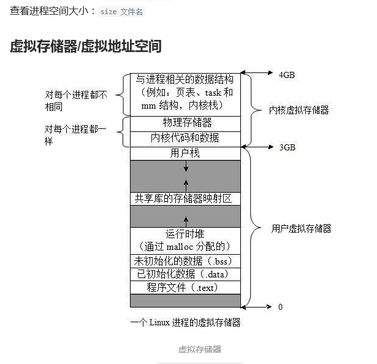
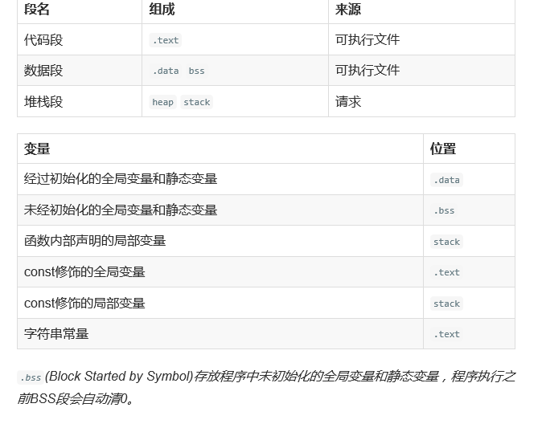
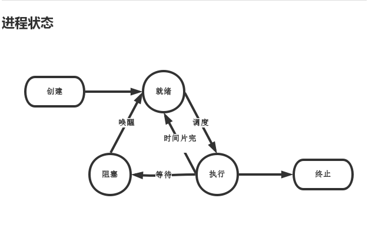

查看进程在哪个终端上运行用tty

stat 状态 R 正在执行 S 正在睡眠

top 动态的进程查询{相当于window下的任务管理器}

/proc 查看生成的进程

./getpid & [去后台运行程序]

getpid() getppid()[得到父进程]

bash[终端]

ps -o pid ppid cmd[命令]

pstree 进程树

size 运行文件 查看大小

readelf -s 运行文件 

并发【同时存在】  并行【并行的一种特例】【同时运行】

对文件描述符是有共享的（文件是共享的）

进程间文件是共享的

excevp

p 文件名【不需要输入路径】  e【环境变量】  v【数组】  l【变参】

(gdb) l  查看所有的代码  b[行数加断点]

exec  会清除虚拟内存中自己的进程代码，如后用自己的代码。

echo $PATH（环境变量）

system(shell字符串) 又返回和普通函数一样[另开了一个进程]

**结束进程**

return

exit

_exit	生病死

main->return->exit->_exit

abort  终止 出车祸死  会有非正常死亡通知，会生成dump文件

信号终止  谋杀[sigkill sigstop]   不能捕获   不能忽略

如何停止进程

休眠 sleep()

暂停  pause()

等待  wait()  waitpid()

fflush(stdout) 清空缓存  \r 回车

异步

为了避免僵死进程的出现使用wait(),等子进程死了父进程把资源回收。 返回值为死掉的子进程id

使用回掉函数，在回掉函数中加入wait()

当子进程死掉时，会通知回掉函数

只要有fork()就有wait()

如果有信号获取的话父进程的sleep会提前终止

wait(&status)

shell脚本

bash shell   c shell

sleep(-1) 永久等待

pause() 专业等信号

export PATH = “ ” 清空终端环境变量

